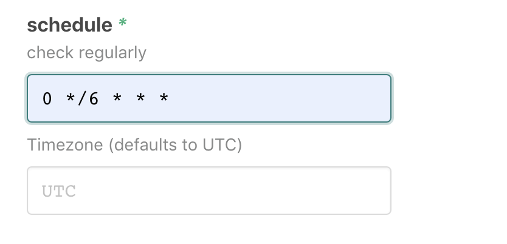

# `@atomist/github-branch-protection-rules`

<!---atomist-skill-readme:start--->

# What it's useful for

> Stop editing branch protection rules in each repo! Set it or update in one
> place and all repos are automatically updated.

# Before you get started

Connect and configure these integrations:

1. **GitHub**
2. **Slack** (optional)

# How to configure

1. **Choose a repository topic**

    Only repositories with this topic will be configured with this branch
    protection rule.

2. **Choose a branch filter**

    Select the set of branches that will be configured with this rule.

3. **Configure the branch protection rule that you want to share**

    The rules are
    [documented here](https://developer.github.com/v3/repos/branches/#update-branch-protection).

    | Rule                            | description                                                                                                       |
    | :------------------------------ | :---------------------------------------------------------------------------------------------------------------- |
    | enforce_admins                  | Enforce all configured restrictions even for administrators.                                                      |
    | required_status_checks          | Require status checks to pass before merging                                                                      |
    | dismiss_stale_reviews           | Automatically dismiss any reviews after a new Commit                                                              |
    | require_code_owner_reviews      | Blocks merging pull requests until [code owners](https://help.github.com/articles/about-code-owners/) review them |
    | required_approving_review_count | Specify the number of reviewers required to approve pull requests.                                                |
    | allow_force_pushes              | Permits force pushes to the protected branch by anyone with write access to the repository.                       |
    | required_linear_history         | Enforces a linear commit Git history, which prevents anyone from pushing merge commits to a branch.               |

4. **Optionally create a cron schedule**

Use this to configure the skill to check all of the repositories periodically,
instead of only on pushes to the repository.



5. **Select the set of Repos that should have this branch protection rule**


## How to use Git Check Repo Contents

All selected repositories will be checked after each Push. If they are found to
be missing the branch protection rule, then it will be configured.

Users can also interactively kick off this skill using Slack.

```
@atomist sync branch protection rules
```

<!---atomist-skill-readme:end--->

---

Created by [Atomist][atomist]. Need Help? [Join our Slack workspace][slack].

[atomist]: https://atomist.com/ "Atomist - How Teams Deliver Software"
[slack]: https://join.atomist.com/ "Atomist Community Slack"
